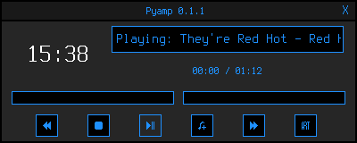

<h3 align="center"></h3>
<h2 align="center">Minimal Python MPD Client</h2>

Pyamp is a minimal mpd client written in python, using the pyside6 and mpd2 libraries.<br>
<br>


### What it can do:
<ul>
<li>Pause, Play, Skip, Rewind and Stop songs.</li>
<li>Display album cover art.</li>
<li>Add songs, as well as clearing the queue.</li>
<li>Display the song currently playing.</li>
<li>Display the song progress using a bar and the actual time elapsed/left.
<li>Change MPD's volume using a slider.</li>
<li>Display the time (clock)</li>
<li>Execute any command on song change</li>
</ul>

### What it can't do (yet):
<ul>
<li>Display the queue.</li>
<li>Interact with playlists.</li>
<li>Toggle random, consume, or single mode.</li>
<li>Remove single songs.</li>
</ul>

### What it will not do:
<ul>
<li>Fetch lyrics from the internet.</li>
<li>Get you a girlfriend.</li>
</ul>
This is my first ever project in any programming language, so the code is very messy and unoptimized. If you want to contribute, fork or even remake Pyamp you are welcome.<br>
Also if you find any bug or have a suggestion, feel free to open an issue and i'll be happy to help.<br>
<br>
<p align="center"></p>
<h2 align="center">Screenshots</h2>
<p align="center"></p>
<p align="center"></p>
<h2 align="center">Installation</h2>

First install python and terminus (font) with your system's package manager.<br>

Then, clone the repo anywhere with git and cd into the cloned directory:<br>
``` Bash
$ git clone https://github.com/themidnightmaniac/pyamp.git
$ cd pyamp
```
Make install.sh executable and run it:
``` Bash
$ chmod +x install.sh
$ ./install.sh
```
Now ur good to go, just run:
``` Bash
$ pyamp
```
and happy listening!

<h2 align="center">Configuration</h2>

With your favorite editor, edit the config file found at ~/.config/pyamp/config.yaml.<br>

__song_format__:<br>
The order of the variables alters the order they're displayed, the available vars, for now, are:<br>
	 - title<br>
	 - album<br>
	 - artist<br>

__run_on_song_change__:<br>
run_on_song_change accepts any script or command, just know it will be stopped when the program closes<br>

__theme__:<br>
you can change between the following themes:<br>
main<br>
midnight_pipe<br>
metal<br>

__Mpd Connection__:<br>
And also, if you changed mpd's host and/or port in mpd.conf, make sure to change it here too. <br>
