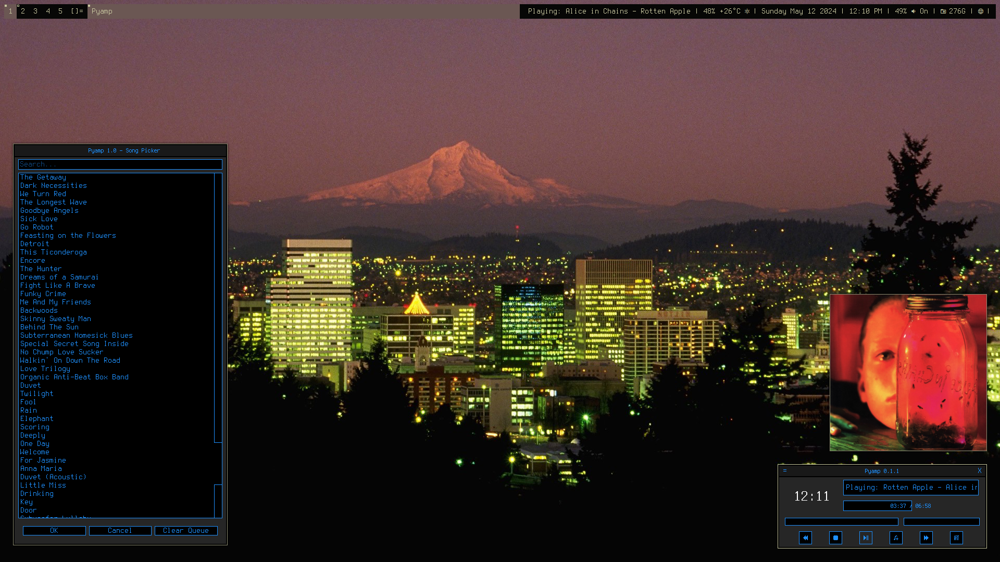

<h3 align="center"></h3>
<h2 align="center">Minimal Python MPD Client</h2>


Pyamp is a minimal mpd client written in python using the qt pyside6 library.

### What it can do:
Pause, play, skip, rewind and stop songs.<br>
Display album cover art.<br>
Add songs as well as clearing the queue.<br>
Display the song currently playing.<br>
Display the progress using a bar and the actual time.<br>
Change MPD's volume using a slider.<br>
Display the time<br>
Execute a command on song change<br>

### What it can't do (yet):
Display the queue.<br>
Interact with playlists.<br>
Toggle random, consume, or single mode.<br>
Remove single songs.<br>
Have multiple themes that you can change between.<br>

### What it will not do:
Fetch lyrics from the internet.<br>
Add album/artist filter to the song picker (i tried).<br>
Get you a girlfriend.<br>

This is my first ever project in any programming language (if you exclude bash lol) so the code is very messy and unoptimized. If you want to contribute, fork or even remake Pyamp you are welcome. Fun fact: The logo was made in ms paint while I was eating pizza.<br>

Also if you find any bug or have a suggestion, feel free to open an issue and i'll be happy to help.<br>

<h2 align="center">Screenshots</h2>
<p align="center"></p>
<p align="center"></p>
<h2 align="center">Installation</h2>

Just clone the repo anywhere with git and cd into the cloned directory:<br>
``` Bash
$ git clone https://github.com/themidnightmaniac/pyamp.git
$ cd pyamp
```
Then make install.sh executable and run it:
``` Bash
$ chmod +x install.sh
$ ./install.sh
```
Now ur good to go, just run:
``` Bash
$ pyamp
```
and happy listening!

<h2 align="center">Configuration</h2>

With your favorite editor, you can edit the config file found at ~/.config/pyamp/config.yaml.<br>

__Mpd Connection__:<br>
If you changed mpd's host and/or port in mpd.conf, make sure to change it pyamp's config too. <br>

__song_format__:<br>
The possible values for song_format, for now, are:<br>
	 - title<br>
	 - album<br>
	 - artist<br>

__run_on_song_change__:<br>
run_on_song_change accepts any script or command, just know it will be stopped when the program closes<br>